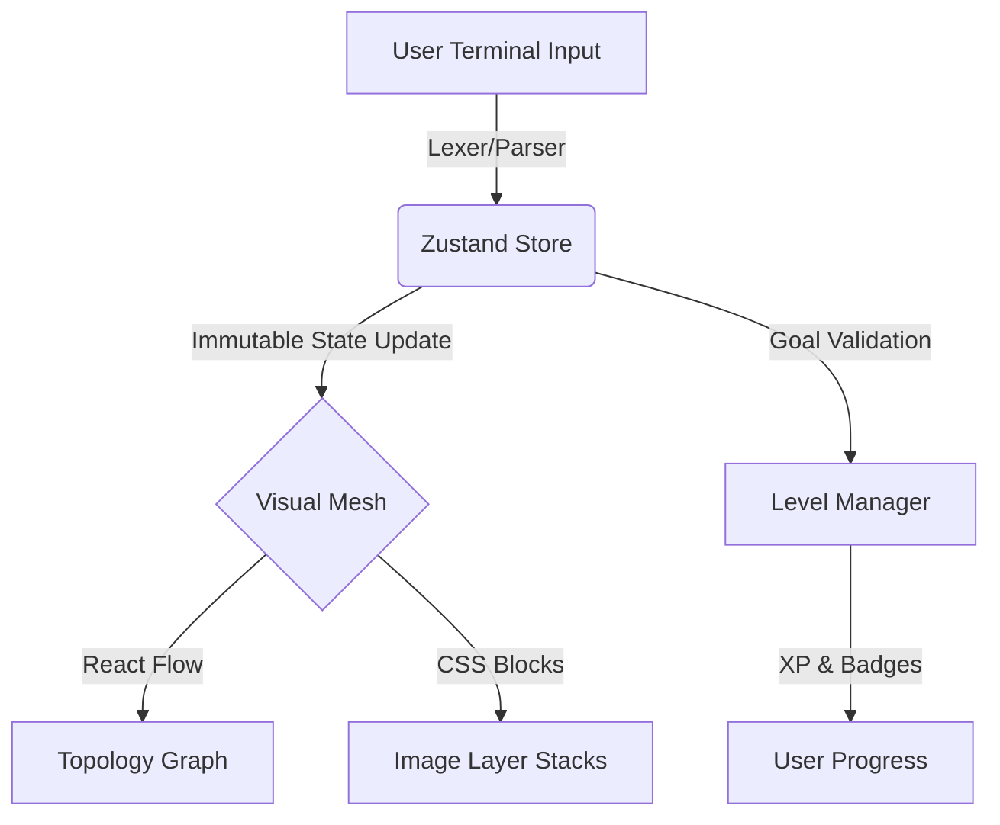

# 🐳 Docker Explorer

> **The Immersive Docker Simulator — Learn by doing, right in your browser.**
> No Docker daemon. No cloud account. Just open the page and start typing.

Inspired by [learngitbranching.js.org](https://learngitbranching.js.org/), **Docker Explorer** demystifies container orchestration through a tight loop of imperative terminal input and declarative graphical output.

[](https://github.com/Abhi21sar/learndocker/actions/workflows/deploy.yml)
[](./LICENSE)
[](https://nodejs.org)
[](https://react.dev)

---

## 🌐 Live Demo

**[https://Abhi21sar.github.io/learndocker](https://Abhi21sar.github.io/learndocker)**

---

## ✨ "Elite" Simulator Features

| Feature | Technical Implementation | UX Benefit |
|---|---|---|
| **Predictive Terminal** | Xterm.js + **Ghost Text** | Reduces syntax errors via gray suggestions |
| **Contextual Autocomplete** | State-aware **Tab completion** | Suggests real container/image names as you type |
| **Advanced Topology** | **React Flow** with animated edges | Visualizes network isolation & connectivity metaphors |
| **State Sync** | **Zustand** immutable store | 100% deterministic visual-logic synchronization |
| **Target vs. Current** | Ghosted goal state overlay | Clear visual roadmap to solve complex exercises |
| **Gamified Pedagogy** | **XP System** + **Git Golf** | Rewards efficiency & mastery of the CLI |

---

## 🏗️ Technical Architecture

Docker Explorer is a 100% client-side application. It utilizes a sophisticated state-driven architecture to simulate a containerized environment:



- **Input processing:** Xterm.js handles the terminal frontend, while a custom lexer provides real-time syntax highlighting.
- **State Management:** **Zustand** acts as the single source of truth, managing the virtualized Docker Engine state (containers, networks, images, volumes).
- **Visualization:** **React Flow** renders the dynamic mesh of container networks, while **Framer Motion** handles fluid transitions.

---

## 📚 Interactive Curriculum (8 Levels)

Master Docker through progressive challenges:

1.  **Welcome to Docker:** `docker run ubuntu` basics.
2.  **Containerizing Apps:** Understanding image build layers.
3.  **Running Detached:** Port mapping and naming.
4.  **Updating Apps:** Stopping and removing resources.
5.  **Sharing:** Pushing to the simulated registry.
6.  **Persistence:** Mounting Docker Volumes for data durability.
7.  **Networking:** Service discovery via bridge networks.
8.  **Orchestration:** `docker compose up` for multi-container apps.

---

## 🚀 Getting Started

### Run with Docker (Recommended)
```bash
docker compose up app
```
Visit `http://localhost:5173`.

### Run Locally
```bash
npm install
npm run dev
```

---

## 🛠️ Supported Commands

The simulator supports a core subset of the Docker CLI:
- `docker run`, `ps`, `stop`, `rm`, `images`
- `docker build`, `pull`, `push`, `tag`
- `docker network create/connect/ls`
- `docker volume create/ls/rm`
- `docker inspect`, `logs`, `exec` (simulated)
- `docker compose up`

---

## 🧱 Tech Stack

- **Framework:** React 19 + Vite 8
- **State:** Zustand (Redux-like immutable state)
- **Visualization:** @xyflow/react (React Flow)
- **Terminal:** Xterm.js + Addons (Fit, WebLinks)
- **Animations:** Framer Motion
- **Icons:** Lucide React

---

## 📄 License

MIT © [Abhishek Gurjar](https://github.com/Abhi21sar) — see [LICENSE](./LICENSE).

<p align="center">Made with ❤️ to make Docker approachable for everyone.</p>
