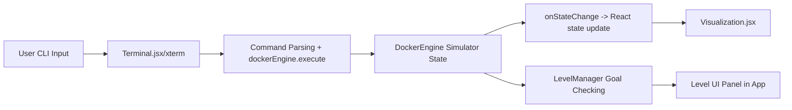

# Docker Learning Platform - Implementation Walkthrough

This project is a Docker-focused simulator that teaches core Docker concepts through a tactile, command-driven interface and a visual “model view” of Docker state.

## Current scaffold (what exists)
- `src/engine/DockerEngine.js`: a small simulator for `docker run`, `docker ps`, `docker images`, `docker stop`, `docker rm`, plus a placeholder `build`.
- `src/components/Terminal.jsx`: an `xterm`-based CLI that forwards typed commands to the simulator.
- `src/components/Visualization.jsx`: renders image “layer stacks” and a grid of active containers.
- `src/levels/tutorial.json`: defines level objectives/goals, but the UI currently does not load levels or evaluate goals.

## Target behavior
1. The CLI accepts a Docker-like subset of commands.
2. Each CLI command mutates the simulator’s state model (images/layers, containers, networks, volumes).
3. After each command, the current level goal is checked against the simulator state + command history.
4. The UI shows the current level objective and indicates when goals are met.
5. Visuals update to show:
   - Vertical layer stacks for images
   - Containers and their configuration (status, networks, mounts)
   - Networks and volume mounts as lightweight indicators/links

## Architecture (high-level)

## Engine/level contract
- The engine should expose:
  - `execute(commandStr)` returning an output string
  - `getSnapshot()` returning a serializable view of state
  - `getHistory()` returning recent command strings
  - a deterministic state evolution (no `Math.random()` for IDs)
- `LevelManager` should:
  - load level definitions from `src/levels/tutorial.json`
  - evaluate goals by reading engine snapshots + history
  - expose `checkCurrentLevel()` and `advance()` APIs for the UI/terminal

## MVP command set to implement (simulated)
- `docker images`
- `docker run [--name <name>] [--network <net>] [-v <vol>:<path>] <image>`
- `docker ps`
- `docker stop <id-or-name>`
- `docker rm <id-or-name>`
- `docker build ...` (simplified layer creation)
- Networking
  - `docker network create <name>`
  - `docker network connect <network> <container>`
- Volumes
  - `docker volume create <name>`
  - mount volumes via `docker run -v ...`
- Compose (simulated)
  - `docker compose up` (creates a small predefined multi-container setup)

## Visual goals
- Switch the image rendering to a “vertical stack” presentation (Dockerfile-layer feel).
- Add a lightweight network and volume indicator:
  - network cards listing which containers are connected
  - container cards showing network memberships and mounts

## Deterministic behavior for level checks
- Replace random container IDs/names with deterministic counters and optional user-provided `--name`.
- This ensures level goals that depend on state are stable across reloads and tests.

